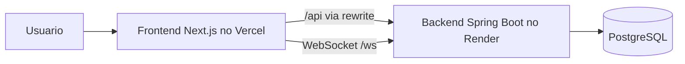

# Arquitetura do sistema

## Visao geral

O projeto foi organizado para ser simples de entender e facil de demonstrar:

## Como o fluxo funciona

1. O usuario abre o frontend.
2. O frontend envia as requisicoes HTTP para `/api/...`.
3. O Next.js faz rewrite para o backend publico.
4. O backend valida o JWT, executa a regra de negocio e grava no PostgreSQL.
5. O painel de pedidos recebe atualizacoes em tempo real via WebSocket.

## Separacao de responsabilidades

- `frontend`: telas, formulários, graficos e experiencia visual
- `backend`: autenticacao, pedidos, estoque, cardapio e analytics
- `database`: persistencia dos dados da aplicacao

## Decisoes que ajudam na demo

- Rewrites do Next.js reduzem problemas de CORS no frontend.
- Seed automatica garante dados de exemplo logo no primeiro acesso.
- WebSocket direto no backend mostra valor tecnico sem adicionar complexidade extra.
- Docker e Render deixam a entrega reproduzivel.

## Pontos importantes para entrevista

- A autenticacao usa JWT com Spring Security.
- O dashboard consome os dados reais do backend.
- O deploy foi desenhado para escalar depois para multi-restaurante, sem reescrever tudo agora.

